# Booking backend

## Tutorial

1. F8 Node - Express
2. [Davegray Node API](https://www.youtube.com/watch?v=JZXQ455OT3A&list=PL0Zuz27SZ-6PFkIxaJ6Xx_X46avTM1aYw)
3. [Mongoose tutorial](https://www.youtube.com/watch?v=DZBGEVgL2eE&t=115s)

## Reference

[Booking hotel Frontend](https://github.com/congnghiahieu/booking-frontend)

[Booking hotel Admin](https://github.com/congnghiahieu/booking-admin)

## Thông tin

- Hiện tại trong quá trình development sẽ sử dụng [MongoDB Cloud](#mongodb-cloud):

  - Không cần start MongoDB tại local
  - Mọi người sử dụng chung 1 DB, tránh bất đồng bộ data
  - Khi dev ổn rồi thì sẽ chuyển sang sử dụng MongoDB local tại 1 máy
  - Tạm thời trong quá trình dev bỏ qua phần data về ảnh cho khách sạn

- Server chạy cổng `8000`
- Đường dẫn: `http://localhost:8000/v1/...`
- Các controller tạm hoàn thiện cơ bản: **/auth/login**, **/auth/logout**, **/auth/register**, **/auth/refresh**,
- Sử dụng [Thunder Client](#hướng-dẫn-sử-dụng-thunder-client) để test

## MongoDB Cloud:

- Sử dụng tương tự MongoCompass ở local
- Đăng ký MongoDB Cloud bằng email, nhắn thông tin **email** tới [Công Nghĩa Hiếu](https://www.facebook.com/hieu.congnghia.71) để add vào CloudDB Project

Demo:

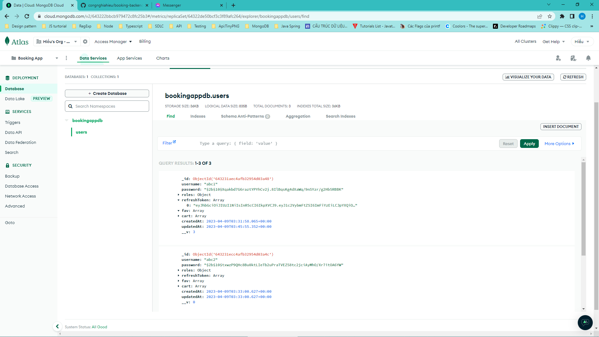

## Hướng dẫn sử dụng Thunder Client

### 1. Cài đặt

Vào VS code, search **"Thunder Client"**

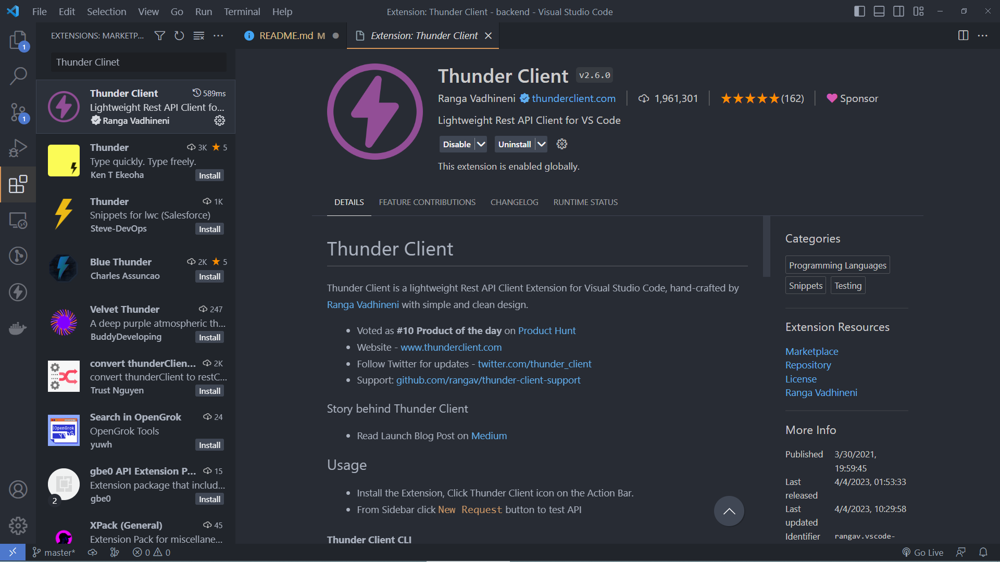

### 2. Sử dụng

#### 2.1 Tạo collection

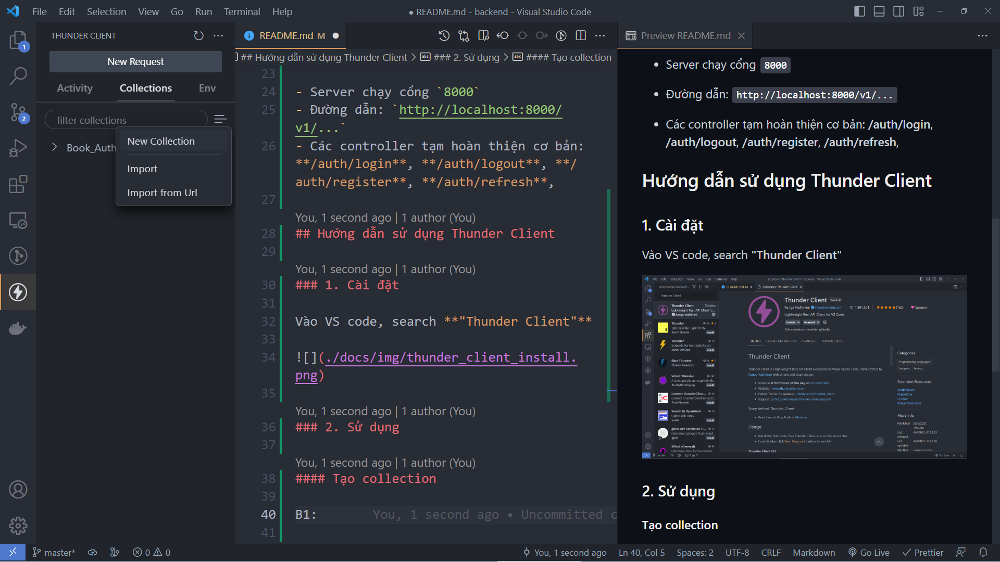

### 2.2 Đặt tên cho collection

VD: Book_Auth

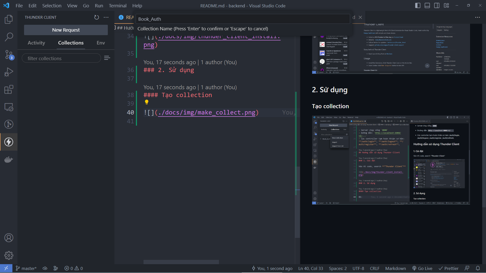

### 2.3 Tạo request mới

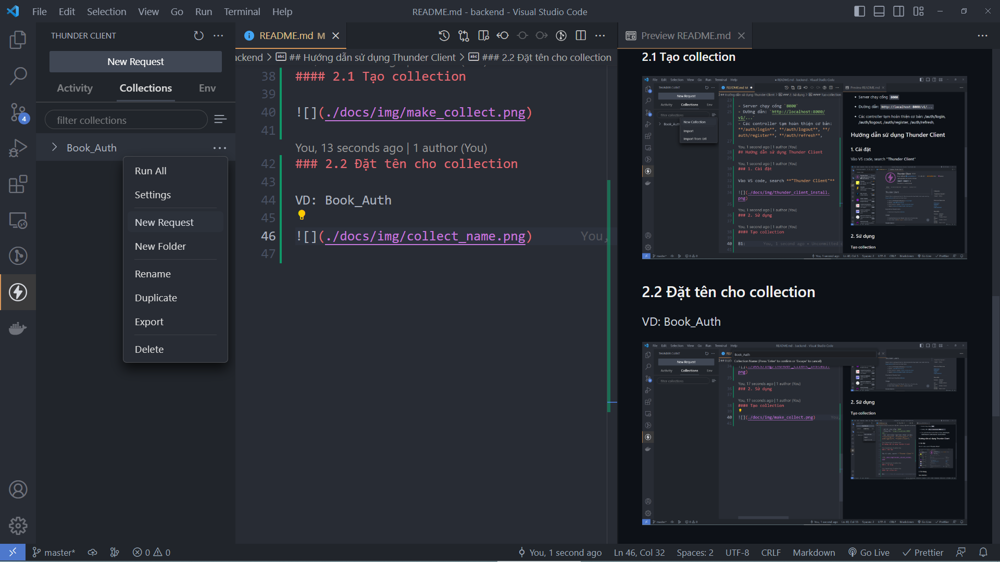

### 2.4 Đặt tên request

VD: Register
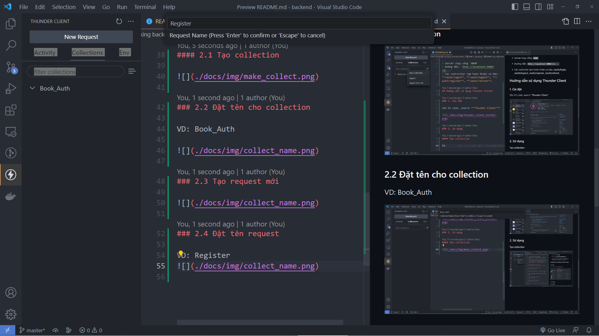

### 2.5 Điền thông tin cho request

VD: Register

- method: POST
- url: http://localhost:8000/v1/auth/register
- body: Vì register có thông tin về **username** và **password** nên sẽ có phần request body (body không bắt buộc với tất cả các request, thường chỉ có POST request sẽ có body) (định dạng _JSON_)

```json
{
  "usename": "abc4",
  "password": "abc4"
}
```

Sau khi gửi request lên **thành công** thì sẽ có response như sau:

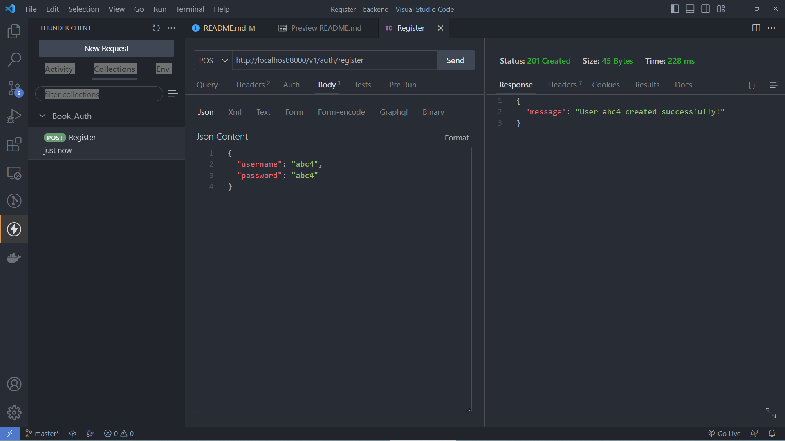

### 2.6 Làm tương tự với các request sau

Login:

- method: POST
- url: http://localhost:8000/v1/auth/login
- body: Thông tin user vừa register

```json
{
  "usename": "abc4",
  "password": "abc4"
}
```

Sau khi login thành công:
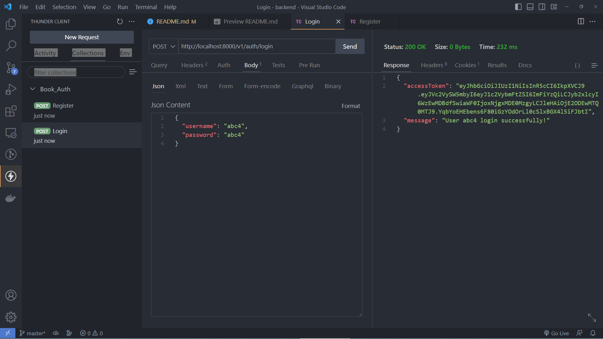

Ngoài ra còn có thêm trả về 1 cookie **'jwt'**

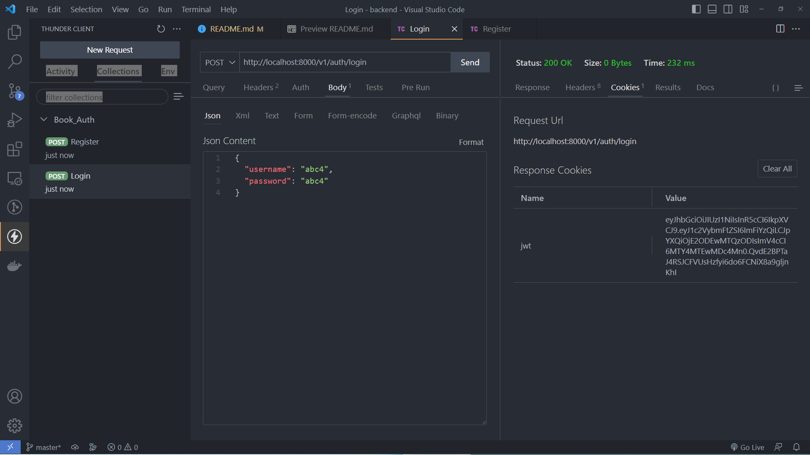

Refresh:

- method: GET ()
- url: http://localhost:8000/v1/auth/refresh
- body: Không cần
- Chú ý: **'refresh'** để làm mới accessToken, tuy không cần request body nhưng cần cookie **'jwt'** (trả về khi login thành công). Nếu không có cookie thì sẽ trả về `401`

Sau khi refresh thành công:
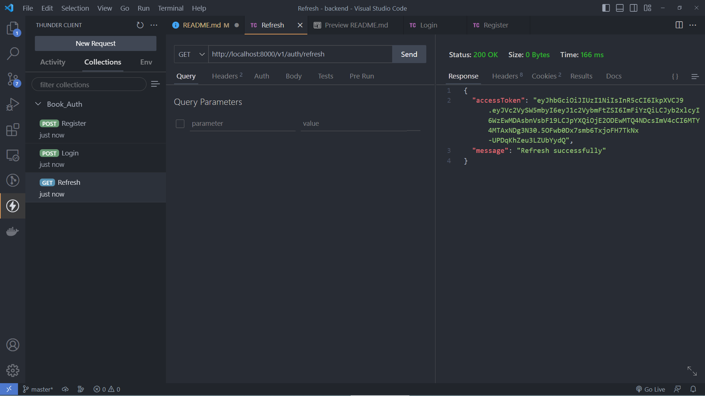

Refresh thành công thì sẽ trả về accessToken mới và cookie **'jwt'** mới

AccessToken mới:


Cookie mới (jwt ở trên là cookie cũ đã bị clear, jwt ở dưới là cookie mới):

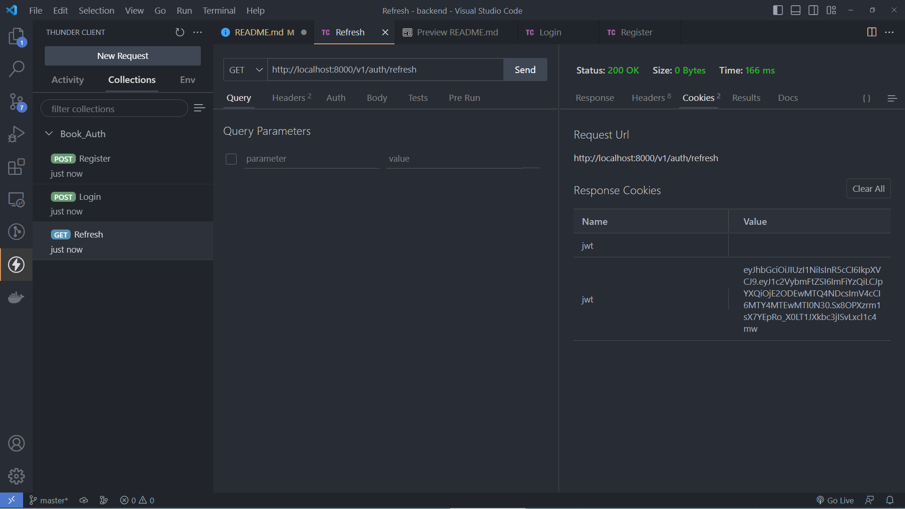

Logout:

- method: GET
- url: http://localhost:8000/v1/auth/logout
- body: Không cần

Sau khi logout thành công:
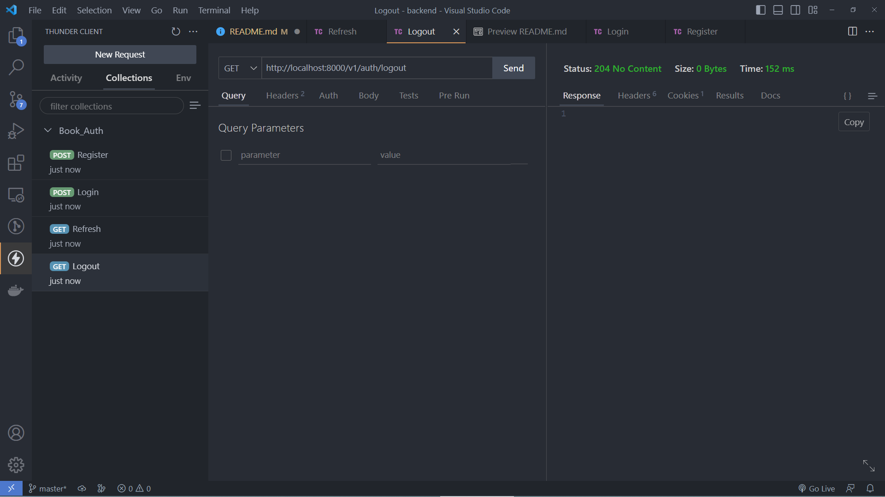

Ngoài ra còn clear cookie **'jwt'** nhận được khi login

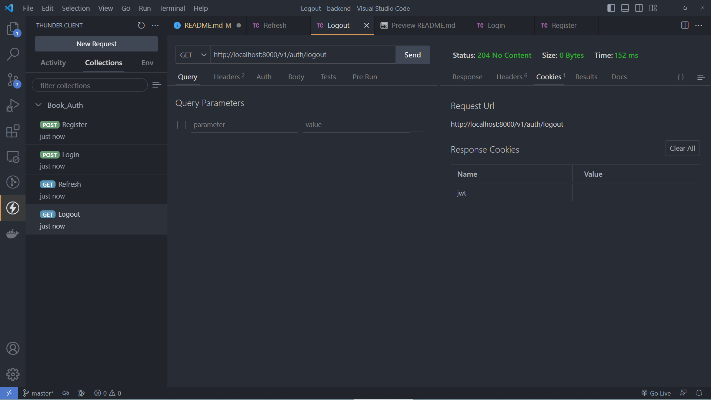
